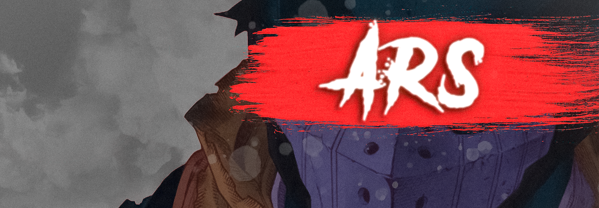

<h2 align="left">Hi 👋! My name is Arshia and I'm a UI designer, from Zanjan,Iran</h2>

  

###

###

  
  
  
  
  
  
  
  
  
  
  
  
  
  
  
  
  
  
  

  
  
  
  
  
  

## 🏆 GitHub Trophies

### ✍️ Random Dev Quote

  ## 💰 You can help me by Donating
   

###

<picture>
  <source media="(prefers-color-scheme: dark)" srcset="https://raw.githubusercontent.com/ARS6666/ARS6666/output/github-snake-dark.svg" />
  <source media="(prefers-color-scheme: light)" srcset="https://raw.githubusercontent.com/ARS6666/ARS6666/output/github-snake.svg" />
  
</picture>
