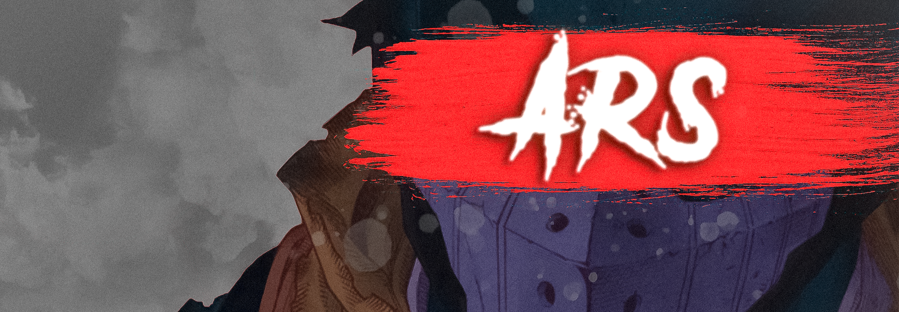

<h1 align="center">Hi 👋, I'm Arshia!</h1>

<h3 align="center">
  UI Designer | Programmer | Cybersecurity Enthusiast  
  From Zanjan, Iran 🇮🇷
</h3>

  

---

  

---

### 🚀 Tech Stack & Skills

  
  
  
  
  
  
  
  
  
  
  
  
  

---

### 📫 Connect with Me

  
  
  
  
  
  

---

### 🐍 GitHub Activity

<picture>
  <source media="(prefers-color-scheme: dark)" srcset="https://raw.githubusercontent.com/ARS6666/ARS6666/output/github-snake-dark.svg" />
  <source media="(prefers-color-scheme: light)" srcset="https://raw.githubusercontent.com/ARS6666/ARS6666/output/github-snake.svg" />
  
</picture>

---

### 🔭 Currently Working On
- Expanding my cybersecurity projects & tools  
- Building sleek UI designs with React  
- Exploring automation with Python scripts  

### 💡 Fun Fact
_"The best way to learn security is to stay curious and keep hacking ethically!"_

---.
